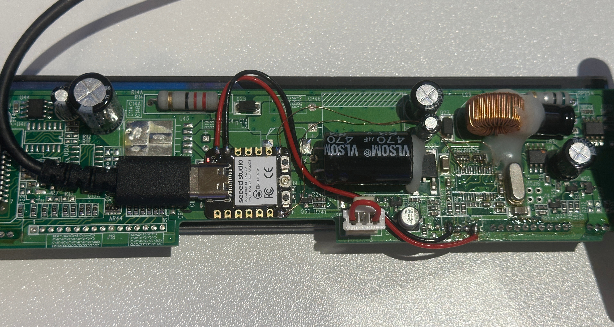

# VFD Display System Monitor
---

I picked up a cheap Vacuum Fluorescent Display (VFD) for a cash register and made a cool PC system monitor. The code is designed to work with any serial VFD display that uses the Epson command set. 

To communicate with my particular unit, I bypassed the RS232 converter and patched directly to the low-voltage pins using XIAO ESP32.

The Arduino client code is designed to work with any serial VFD display that uses the Epson command set. It uses a buffer to dynamically update the display row-by-row, without clearing the screen, eliminating flickering and provides seamless transitions.

---

## Installation

### 1. Arduino Client
Compile and upload the code for the Arduino client using PlatformIO or the Arduino IDE.

### 2. Host Setup

#### Prerequisites
- Ensure Python 3 is installed on your system.
- Have `systemd` (most modern Linux distributions include it).

### Steps
1. Open a terminal in the project directory.
2. Make the installation script executable:
   ```bash
   chmod +x setup.sh
   ```
3. Run the setup script:
   ```bash
   sudo ./setup.sh
   ```
   This will:
   - Create a Python virtual environment in the project directory.
   - Install dependencies from `requirements.txt`.
   - Create and configure a `systemd` service file for the daemon.
   - Enable and start the daemon automatically.

---

## Debug

To check if the daemon is running:
```bash
sudo systemctl status vfd_display.service
```

To see error messages or logs:
```bash
sudo journalctl -u vfd_display.service
```

## 
